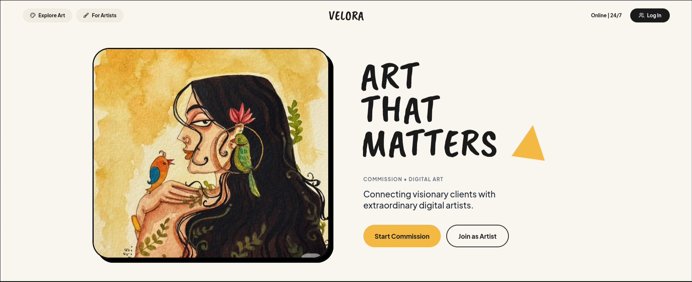

<div align="center">
  
  <br>
  <br>
  <h1>Velora - Digital Art Marketplace</h1>
  <p><strong>A Neo-Brutalist Platform Connecting Clients with Talented Digital Artists</strong></p>

  <p>
    
    
    
    
  </p>
</div>

---

## 🌟 About The Project

**Velora** is a fully-featured digital art commission marketplace built on a robust Django backend. It features a striking **Neo-Brutalist** design system and provides a secure, end-to-end workflow for artists and clients to collaborate on custom artwork. From initial request to final escrow payout, Velora handles the entire lifecycle securely and beautifully.

## 🚀 Key Achievements & Features

### 🎨 Seamless Neo-Brutalist Design
- Transitioned entirely from React to server-side rendered Django HTML templates.
- Designed an aesthetic interface characterized by stark contrasts, solid black borders, drop shadows, and vibrant accent colors using **Vanilla HTML and Tailwind CSS**.

### 💼 Client & Artist Workflows
- **Clients** can post detailed commission requests, specify budget constraints, upload references, and browse artist portfolios.
- **Artists** have dedicated profiles, can showcase their past work, filter open requests by tag, and submit competitive proposals with delivery timelines.
- Real-time order tracking: Visual pipelines from `Proposal` → `In Progress` → `Submitted` → `Revision Requested` → `Completed`.

### 🛡️ Secure Escrow & Payments
- Fully integrated with **Razorpay**.
- **Buyer Protection:** When a proposal is accepted, the client's funds are captured and held securely in **Escrow**.
- Funds are only released to the artist after the client explicitly reviews the watermarked preview and approves the final high-resolution delivery.
- Comprehensive security implementations preventing CSRF attacks and state-machine bypass vulnerabilities.

### ⚖️ Dispute Management System
- If an order goes wrong, either the client or artist can freeze the workflow by **raising a dispute**.
- An advanced administrative resolution engine allows admins to:
  - Review the dispute reason, escrow details, and submission timeline.
  - **Refund the Client**: Cancels the order and returns funds via Razorpay.
  - **Release to Artist**: Bypasses the client and releases funds to the artist.
  - **Dismiss Case**: Unfreezes the workflow to continue normally.

### 📊 Admin Tools
- Granular control over users, orders, and payments.
- Generation of detailed **PDF Financial Reports** directly from the dashboard using WeasyPrint.

---

## 📚 Documentation

For a deeper technical dive into the architecture and state machines, check out the documentation:
*   [Features & Role Workflows](documentation/features.md)
*   [Architecture & Order Flow](documentation/architecture.md)

---

## 🛠️ Technology Stack

| Category | Technology |
|---|---|
| **Backend Framework** | Django, Python |
| **Frontend Styling** | Tailwind CSS, HTML5, Vanilla JavaScript |
| **Database** | MySQL |
| **Payment Gateway** | Razorpay SDK |
| **Report Generation**| WeasyPrint |

---

## 💻 Getting Started

Follow these steps to run Velora locally on your machine.

### Prerequisites
- Python 3.x
- MySQL Server

### Installation

1. **Clone the repository:**
   ```bash
   git clone https://github.com/yourusername/velora.git
   cd velora
   ```

2. **Install dependencies:**
   ```bash
   pip install -r requirements.txt
   ```

3. **Environment Setup:**
   Create a `.env` file in the root directory containing your credentials:
   ```env
   SECRET_KEY=your_django_secret
   DEBUG=True
   DB_NAME=velora
   DB_USER=root
   DB_PASSWORD=yourpassword
   RAZORPAY_KEY_ID=your_razorpay_key
   RAZORPAY_KEY_SECRET=your_razorpay_secret
   ```

4. **Database Migrations:**
   ```bash
   python manage.py makemigrations
   python manage.py migrate
   ```

5. **Start the Development Server:**
   ```bash
   python manage.py runserver
   ```
   Navigate to `http://127.0.0.1:8000/` in your browser.

---
<div align="center">
  <i>Built with precision and style.</i>
</div>