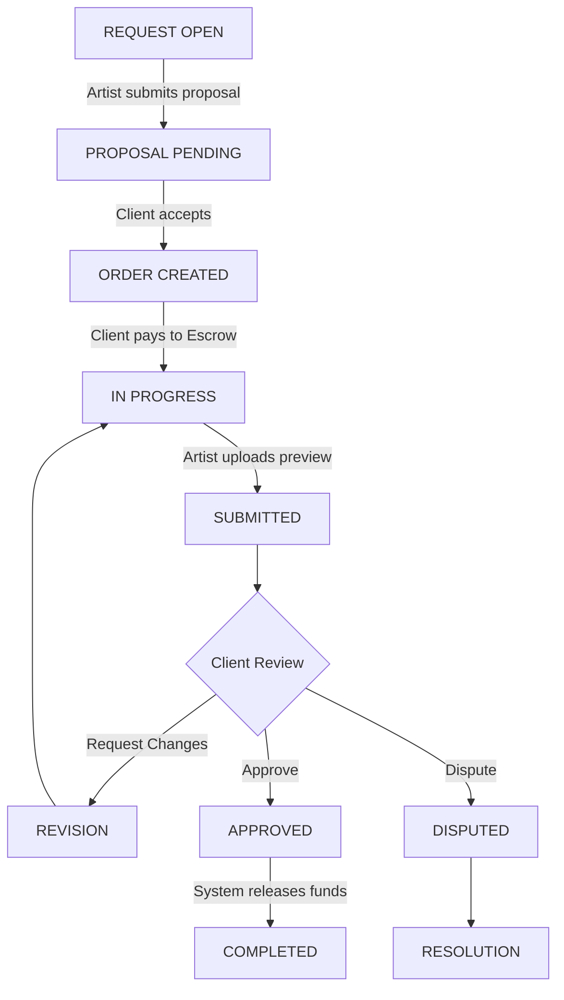
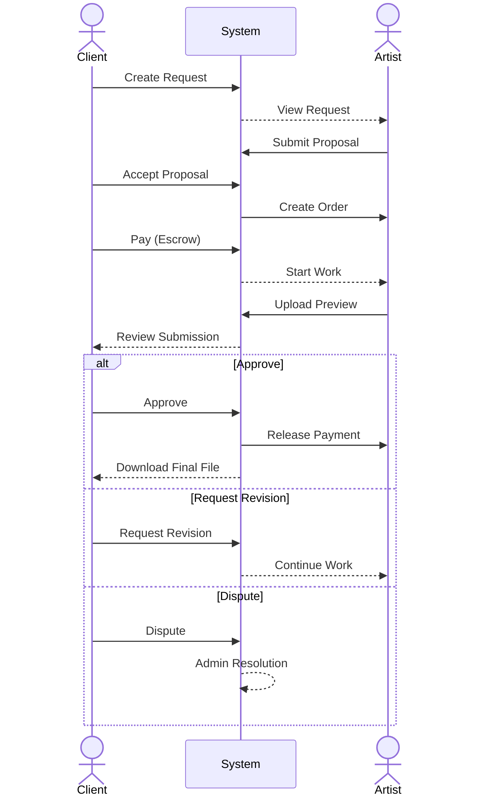

# Velora Architecture & Order Flow

## Overview
Velora is a digital art marketplace platform connecting Clients with Artists. The platform handles everything from initial request creation to proposals, secure payments (escrow), artwork delivery, revisions, and final approval.

## Order Life Cycle

## Detailed Interaction Flow

